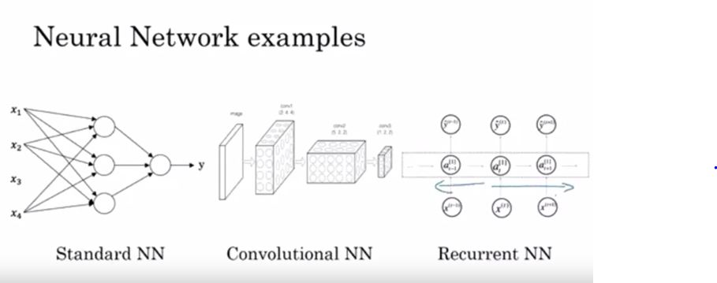

## Introduction to deep learning

### Sectors:
- healthcare
- agriculture
- self driving car
- etc.

### Neural Network:

Sample neural network in the following picture:

- leftmost layer is the input layer
- rightmost layer is the output layer
- layers in the middle are called hidden layers
- neural network itself is supposed to build the hidden layers

### Supervised Learning with Neural Networks

#### Standard Neural Network:
Real Estate, Online advertising

#### CNN:
Photo tagging

#### RNN:
Audio, Language

#### Custom/Hybrid Neural Network:
Autonomous Driving

### Structured Data

Well defined data. 
Ex: Size of bedroom, number of rooms in Real Estate example

### Unstructured Data

Not so well defined.
Ex: Audio, Image, Text.
